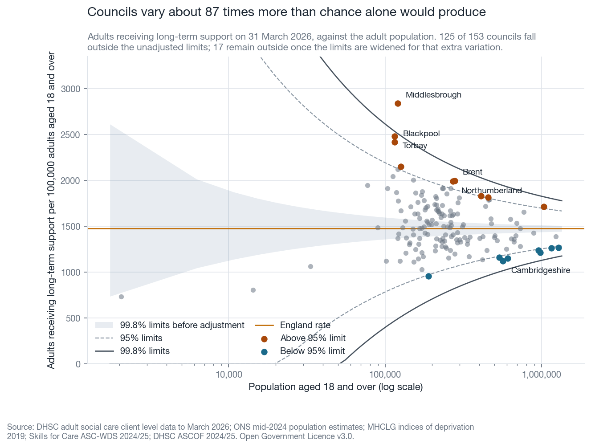
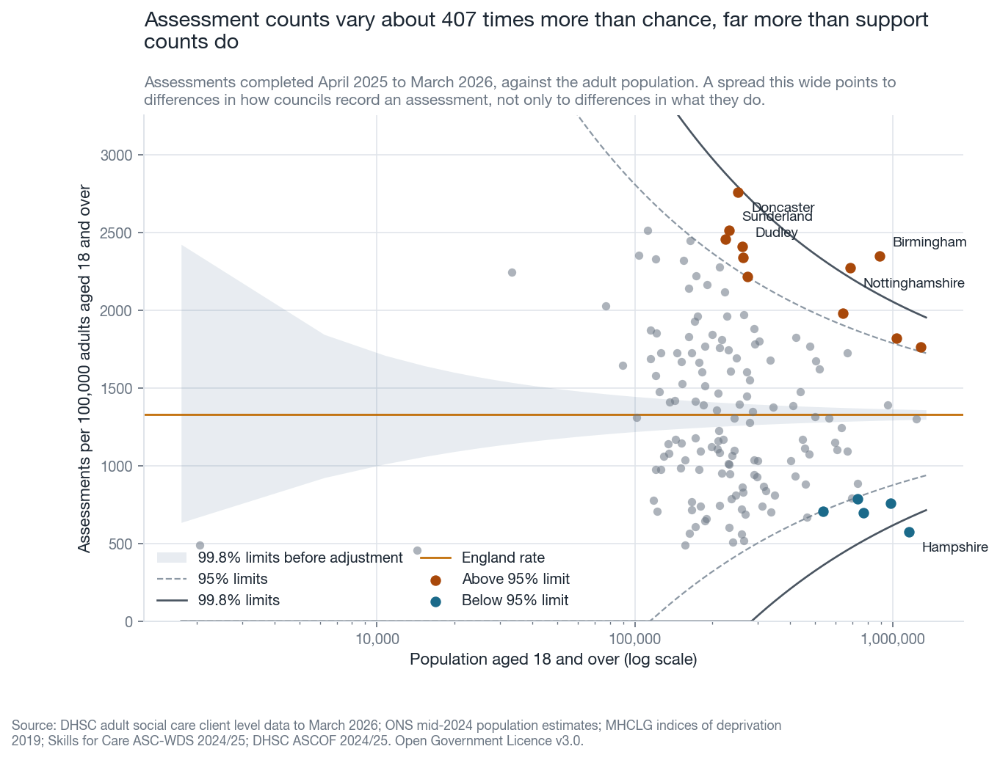
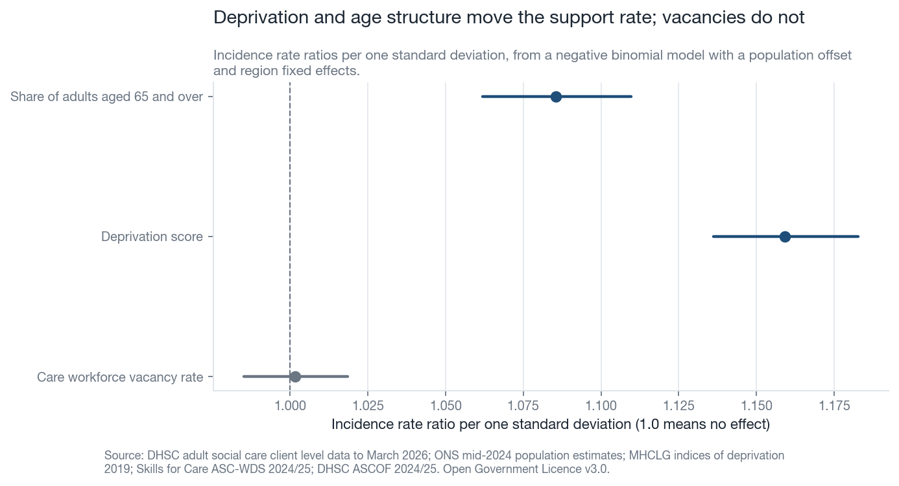
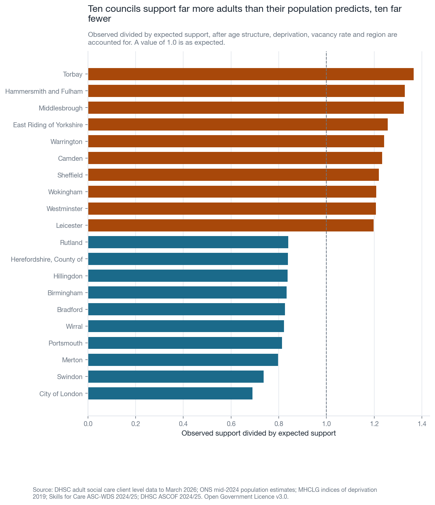
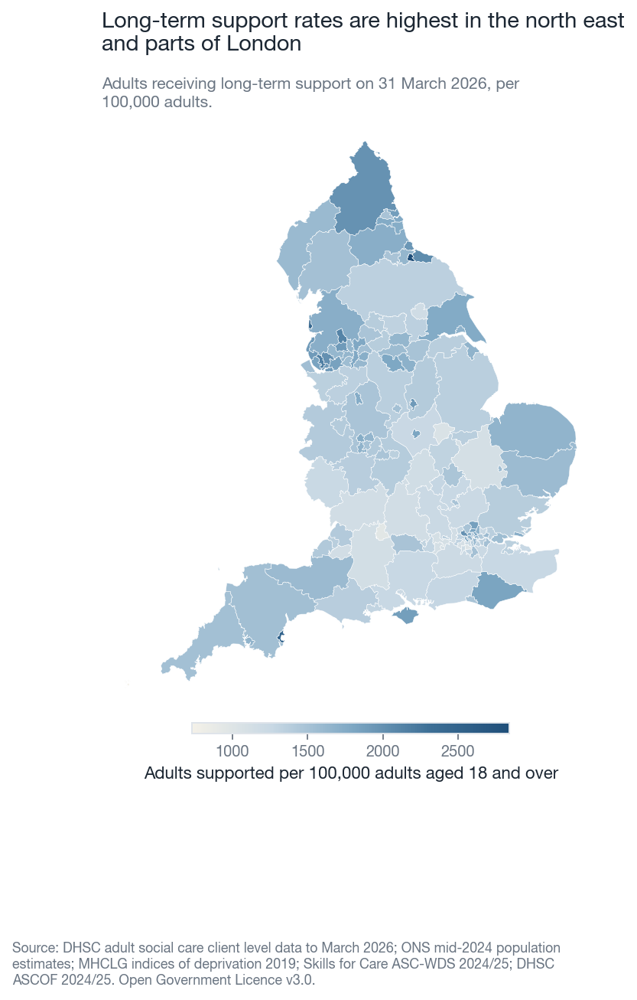
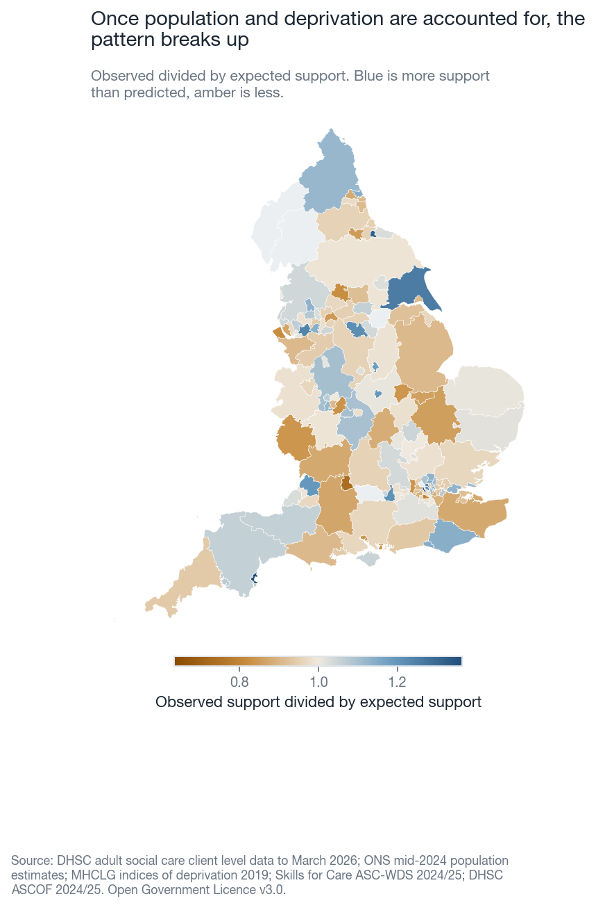
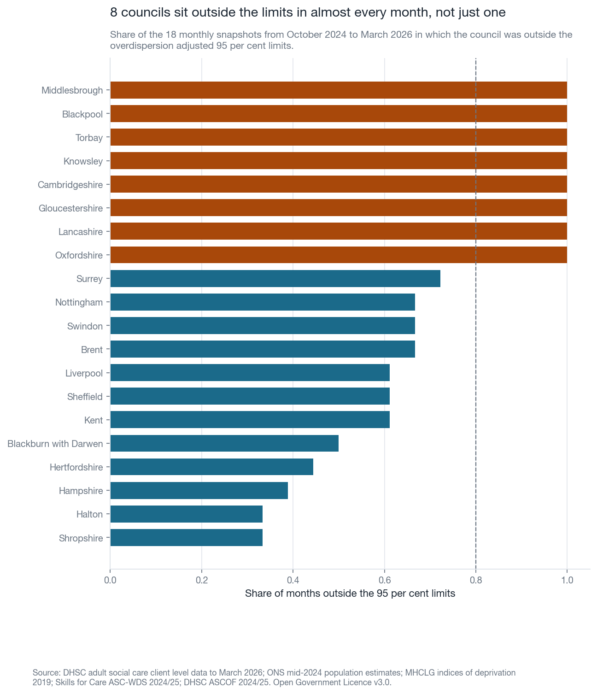

# Adult social care: how much local variation survives the obvious explanations

## The question

Local authorities in England support very different shares of their adult
population. Some of that difference is expected, because authorities differ in
how old their populations are, how deprived they are, and how easy it is to
recruit care workers locally. This project asks how much variation is left once
those three things are accounted for, and which authorities remain outliers when
they are.

## Why this matters

Client level data is the first record-level national collection covering adult
social care in England. Councils have been required to submit it since April
2023, and it now feeds the Activity and Finance Report and six measures in the
Adult Social Care Outcomes Framework. That makes it the first dataset capable of
supporting this kind of comparison, and it means answers drawn from it will
increasingly shape how councils are judged.

The timing matters too. The Casey Commission timetable was accelerated during
2026, so questions about which councils are outliers and why are being asked
under pressure. Hospital discharge pressure pushes in the same direction,
because a council that cannot arrange long-term support quickly becomes a
constraint on the health service as well as on its own residents. A council
named as an outlier deserves to know whether the finding survives adjustment for
the things it cannot control.

## The data

Every file is downloaded by `scripts/download.py` from a published URL, and
`data/raw/MANIFEST.json` records the download date and a SHA256 hash for each
one. Nothing is edited by hand.

| Source | Publisher | What it provides |
| --- | --- | --- |
| Client level data, long-term support, to March 2026 | DHSC | Adults receiving long-term support, monthly, by council |
| Client level data, assessments, to March 2026 | DHSC | Assessments completed, monthly, by council |
| Client level data, September and December 2025 releases | DHSC | Earlier monthly snapshots for the panel |
| Mid-2024 population estimates, MYE2 | ONS | Population by single year of age |
| Indices of deprivation 2019, File 11 | MHCLG | Average deprivation score at upper tier |
| ASC-WDS local area estimates 2024/25 | Skills for Care | Care workforce vacancy rate |
| ASCOF 2024/25, Table 1a | DHSC | Measure 1A, social care related quality of life |
| Counties and unitary authorities, December 2023 | ONS Open Geography | Boundaries for the maps |

All of it is published under the Open Government Licence v3.0, except the Skills
for Care estimates, which are free to reuse with attribution.

The analysis covers 153 upper tier councils, which is every
council in England responsible for adult social care.

## The method

### Building one table

One row per council, holding the count of adults receiving long-term support on
31 March 2026, the number of assessments completed over
April 2025 to March 2026, the adult and older adult populations, the
deprivation score, the care workforce vacancy rate and ASCOF measure 1A.

### Funnel plots

A funnel plot is a chart that shows each council as a point, with the size of its
population along the horizontal axis and its rate up the vertical axis. Curved
control limits fan out from the national rate, wide where populations are small
and narrow where they are large, because a rate measured over a small population
moves around more. A council outside the limits has a rate that chance alone does
not explain.

The limits here are exact Poisson limits, widened for overdispersion.
Overdispersion is the tendency for real councils to vary more than chance
predicts. It is measured by the dispersion ratio, which is the average squared
standardised residual after the most extreme ten per cent at each end have been
pulled back to the tenth and ninetieth percentiles. That winsorising step stops a
few genuine outliers from widening the limits so far that they hide themselves.
The method follows Spiegelhalter (2005), which is what OHID uses in Fingertips.
Lower limits are clipped at zero.

Both the adjusted and the unadjusted limits are drawn. With counts this large the
adjustment is severe, and showing only the adjusted limits would hide how far the
councils are spread.

### Slope and relative index of inequality

The slope index of inequality is a number that describes the whole gap in a rate
between the most deprived end of a distribution and the least deprived end.
Councils are ranked by deprivation score and given a position from zero at the
least deprived end to one at the most deprived end. That position is a ridit
score, meaning it is the midpoint of the share of population the council
occupies once every council is lined up in deprivation order, so a large council
counts for more than a small one. The rate is then regressed on that position by
weighted least squares. A positive slope index means the rate is higher in more
deprived areas.

The relative index of inequality is the same gap expressed as a proportion of the
average rate, which makes it comparable between measures on different scales.

### Negative binomial model

A negative binomial model is a regression for counts that allows the counts to
vary more than a Poisson model permits. The population is entered as an offset,
which turns a model of the count into a model of the rate. The three covariates
are standardised, so each coefficient describes what happens when that covariate
rises by one standard deviation. Region indicators are included, so councils are
compared with their neighbours as well as with the country.

The dispersion parameter is estimated by the Cameron and Trivedi auxiliary
regression rather than assumed. A coefficient is reported as an incidence rate
ratio, which is the multiplier applied to the rate for a one standard deviation
rise. A ratio of 1.10 means a ten per cent higher rate, and a ratio of 1.00 means
no effect.

### Observed and expected

The observed to expected ratio divides the number of people a council actually
supports by the number the model predicts it would support given its population,
deprivation, vacancy rate and region. A ratio of 1.0 means a council supports
exactly as many people as predicted. The ratio is the measure of unexplained
variation, and it is what the second map shows.

### The monthly panel

The quarterly releases overlap, so stitching them together gives a run of
monthly snapshots. A funnel plot is fitted for each month separately. A council
is called persistent when it sits outside the 95 per cent limits in at least four
fifths of the months it appears in, and transient when it steps outside in some
months but not most. The inner limits are used because the adjusted outer limits
catch almost no council in any month, which would make every council look settled
whatever it did.

## What the analysis found

### Variation is very large, and most of it is not chance

Across the 153 councils, the long-term support rate runs from
733 to 2,841 adults per 100,000, a
3.9-fold gap between the lowest and the highest. The
median is 1,486 and the middle half of councils fall between
1,328 and 1,688. The England rate is
1,475 per 100,000.

Before any adjustment, 125 of 153 councils
sit outside the 99.8 per cent Poisson limits. That is the first result worth
stating, because it means the differences between councils are nothing like
sampling noise. The dispersion ratio is 86.7, so councils vary
roughly 87 times more than chance alone would produce.

Once the limits are widened by that amount, 1 council sits
outside the 99.8 per cent limits and 17 sit outside the 95 per
cent limits. Both numbers are in the chart below, because the gap between them is
the point. The overdispersion adjustment asks whether a council is unusual
compared with how much councils actually differ, not compared with chance, and on
that test almost none is.

Middlesbrough has the highest rate at 2,841 per
100,000 and Isles of Scilly the lowest at 733.



Assessments vary far more. The England assessment rate is
1,329 per 100,000 adults over the year, and the dispersion
ratio is 407, which is several times the ratio for support.
A spread that wide is unlikely to be describing need alone. It is more likely
that councils are not yet recording an assessment in the same way as each other,
which is worth knowing before any assessment based measure is used to compare
them.



### Deprivation runs the wrong way for a simple story

The slope index of inequality is 547 per 100,000, with a 95
per cent interval from 442 to
652. Read directly, that means the support rate is
547 per 100,000 higher at the most deprived end of
the distribution than at the least deprived end. The interval does not cross zero, so the gradient is unlikely to be chance. The relative
index is 0.371, so the gap is
37.1 per cent of the average rate of
1,475.

### The model explains part of the variation, and the vacancy rate is not the part

The negative binomial model fitted to 147 councils has a dispersion
parameter of 0.0075 and explains
63.6 per cent of the deviance.

| Covariate | Rate ratio per standard deviation | 95% interval |
| --- | --- | --- |
| Share of adults aged 65 and over | 1.086 | 1.062 to 1.110 |
| Deprivation score | 1.159 | 1.136 to 1.183 |
| Care workforce vacancy rate | 1.002 | 0.985 to 1.018 |

The care workforce vacancy rate cannot be separated from no effect. That is worth stating plainly,
because vacancy pressure is often offered as an explanation for why councils
differ in how many people they support, and at this level of aggregation it does
not carry that weight.



### A lot of variation is left over

Observed to expected ratios run from 0.69 to
1.36. Torbay supports
1.36 times as many adults as the model predicts, and
City of London supports 0.69 times as
many. 9 councils are more than a fifth above prediction and
3 are more than a fifth below it.



The raw rate map shows a recognisable geography. The observed to expected map
does not, which is the point of drawing both.





### Outliers are mostly not a one-month accident

Across 18 monthly snapshots from October 2024 to
March 2026, 8 councils sit outside the 95 per cent
limits in at least four fifths of months, 20 step outside in
some months but not most, and 125 never step outside at all. The
persistent group is Blackpool, Cambridgeshire, Gloucestershire, Knowsley, Lancashire and Middlesbrough, and 2 others.



## Limits

These statistics are official statistics in development, which means the
publisher has said they are not yet fully assured and may change.

Coverage is incomplete in places. The care workforce vacancy rate is missing for
6 councils: Brent, Cumberland, Doncaster, Isles of Scilly, West Berkshire and Westmorland and Furness Council.
Those councils drop out of the model but stay in the funnel plots.

The January and April 2026 client level data releases were issued under
correction, and the September and December 2025 files used here are the corrected
July 2026 versions. Figures for recent months are marked provisional by the
publisher.

The main model is cross-sectional. It describes which councils differ from
prediction on one date, and it cannot say what caused the difference.

Eligibility policy is not modelled. Councils apply the Care Act eligibility
criteria with real local discretion, and a council that supports fewer people may
be applying a stricter threshold rather than meeting less need. Nothing in open
data measures that threshold.

The denominator lags the numerator. The support counts are from March 2026 and
the population estimates are mid-2024, so councils growing quickly will look as
though they support a slightly higher share of adults than they do.

Deprivation is measured in 2019. Five councils were created by reorganisation
after that, and they inherit the score of the county they replaced, which is an
approximation.

## So what

Three things follow for a director of adult social services.

The first is that being an outlier on the raw rate is not by itself evidence of
anything. Roughly a third of the raw gap between councils survives adjustment for
age structure, deprivation and region, and the rest does not.

The second is that the vacancy rate does not explain the residual. If a council
is supporting far fewer adults than prediction, workforce supply is unlikely to
be the reason, and the eligibility threshold is the more probable place to look.

The third is that persistence is the signal worth acting on. A council outside
the limits in one month may be a data artefact. A council outside them in almost
every month for over a year is describing a settled difference in practice, and
those are the councils named above.

## Reproduce

From a fresh clone:

```bash
python -m venv .venv && source .venv/bin/activate
pip install -r requirements.txt
python scripts/download.py
cd projects/adult-variation && python make_all.py
```

`make_all.py` writes every chart and table in `outputs/`, writes
`outputs/findings.json`, and regenerates this README from it. Run `pytest` from
the repository root to check the loaders and the statistical functions.

## Next steps

Model the eligibility threshold directly by pairing assessment counts with the
share of assessments leading to long-term support, which would separate councils
that assess few people from councils that assess many and support few.

Extend the panel as further quarterly releases appear, so that persistence can be
measured over several years rather than a single stretch of months.

Add unit costs from the Activity and Finance Report, so that the question becomes
how much support each council buys rather than how many people it supports.

Test whether the councils that remain outliers after adjustment differ on ASCOF
measure 1A, which would show whether unexplained variation in support levels
reaches the people using services.
