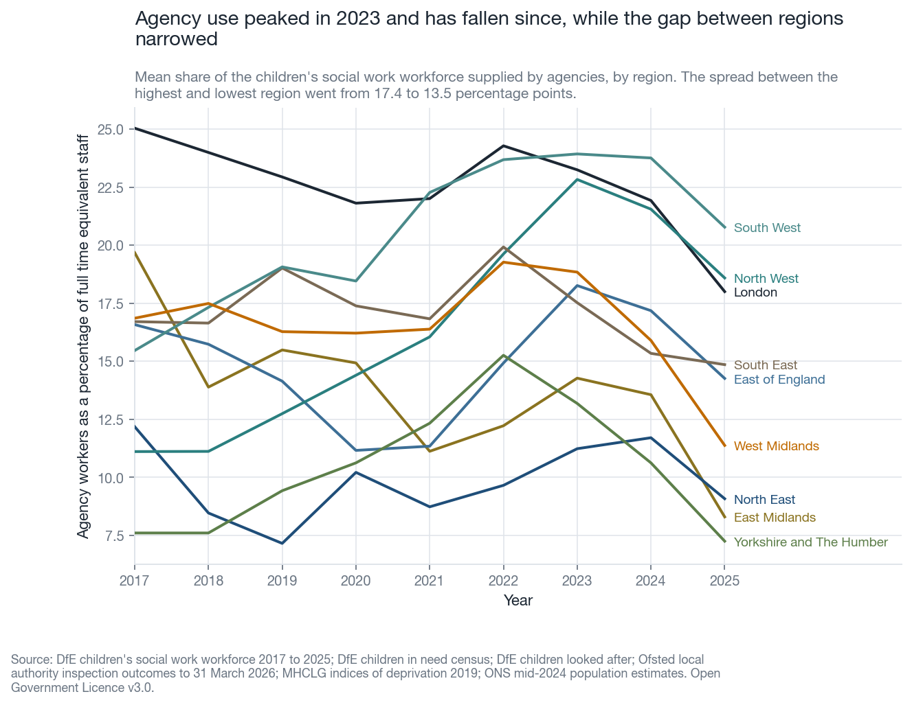
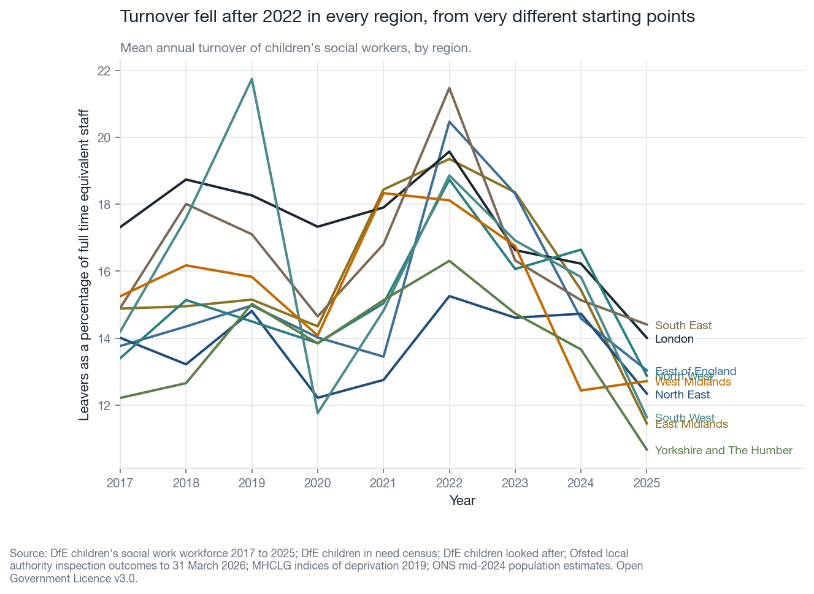
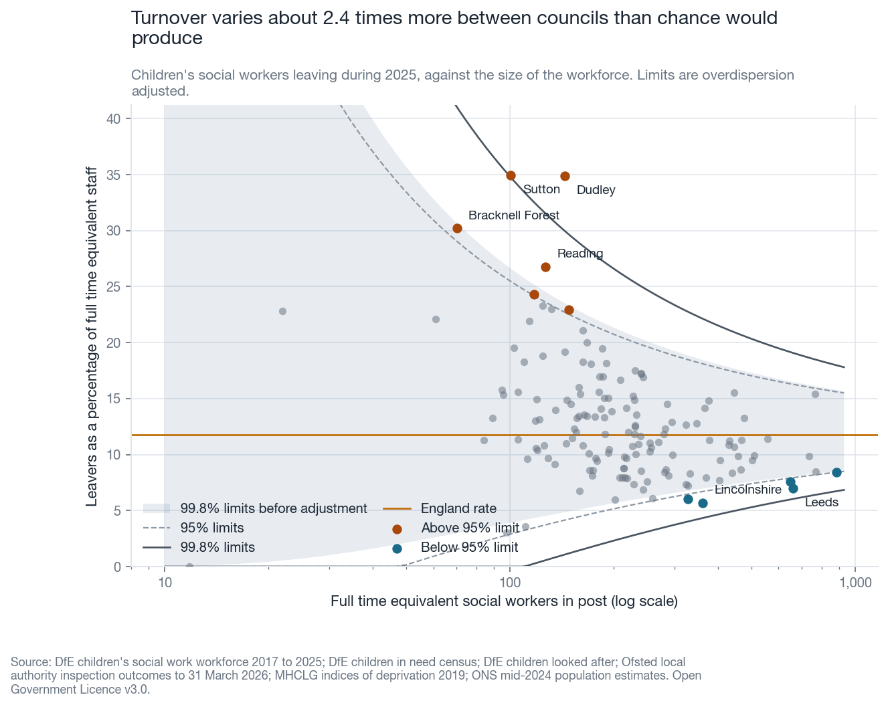
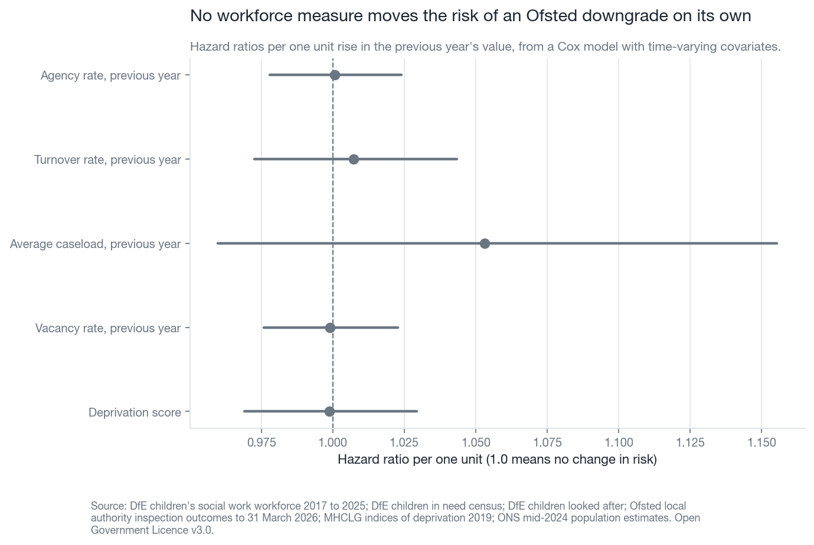
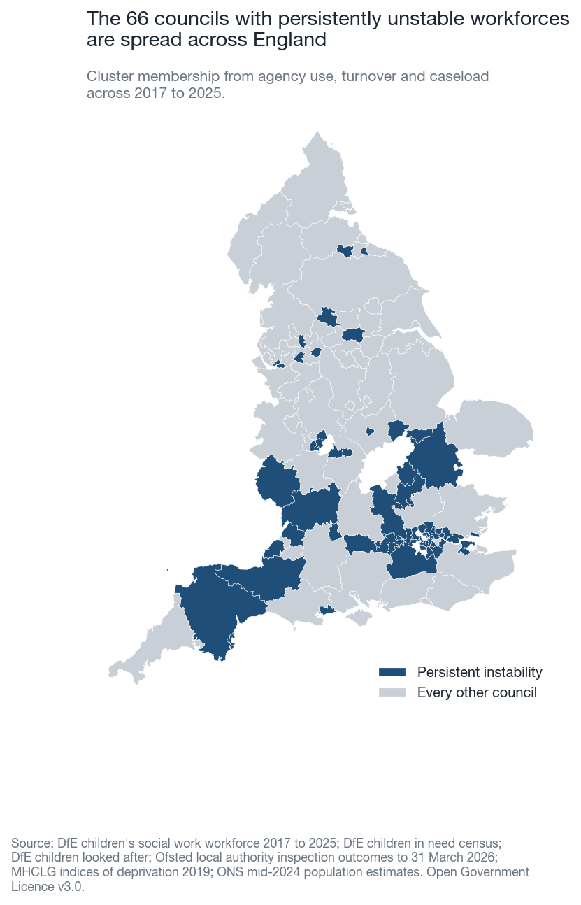
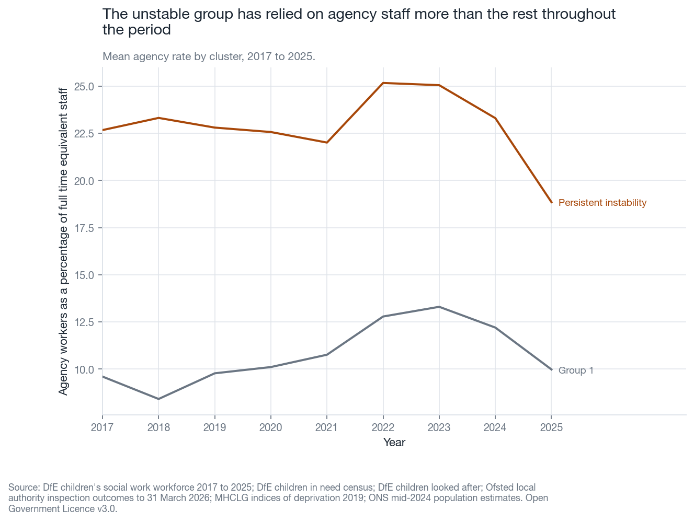

# Children's social work workforce instability and outcomes

## Question

Children's services depend on holding onto social workers. This project asks
whether workforce instability in one year, measured by turnover, vacancies,
agency reliance, caseload and sickness absence, predicts worse things later: an
Ofsted downgrade, more children re-referred within a year, more children back on
a second protection plan, and more children moved between placements. The panel
runs from 2017 to 2025.

## Context

An authority that cannot keep social workers is usually described as being at
risk, and agency reliance in particular is treated as a warning sign. That belief
drives real decisions about intervention and improvement support. This project
tests whether the open data bears it out.

No measure of social worker wellbeing exists at local authority level in open
data. Nothing published by authority records whether social workers feel
able to do the job, whether they are burnt out, or whether they intend to leave.
Sickness absence and agency reliance are used here as proxies, and they are poor
ones, because a council can have low sickness absence and an exhausted workforce.
National surveys by the British Association of Social Workers and by the Local
Government Association do ask those questions, but they report nationally and
cannot be joined to a council. The absence of that measure is a finding of this
project. Any conclusion drawn below about wellbeing is inference from staffing
behaviour, not measurement of how staff are.

## Data

Every file is downloaded by `scripts/download.py` from a published URL, and
`data/raw/MANIFEST.json` records the download date and a SHA256 hash for each
one.

| Source | Publisher | What it provides |
| --- | --- | --- |
| Children's social work workforce, 2017 to 2025 | DfE | Turnover, vacancy, agency, caseload, sickness absence, staff in post |
| Children in need census | DfE | Re-referrals within twelve months, repeat protection plans |
| Children looked after in England | DfE | Children with three or more placements in the year |
| Local authority inspection outcomes to 31 March 2026 | Ofsted | Every ILACS inspection with its date and grade |
| Indices of deprivation 2019, File 11 | MHCLG | Average deprivation score at upper tier |
| Mid-2024 population estimates, MYE2 | ONS | Population aged 0 to 17 |
| Counties and unitary authorities, December 2023 | ONS Open Geography | Boundaries for the map |

All of it is published under the Open Government Licence v3.0.

The panel holds 1349 authority years covering
151 authorities.

### Local government reorganisation

Six areas reorganised during the period, and two metropolitan districts were
given new codes. Every source is translated onto one set of authority codes
before anything is joined. Where a county split into unitary authorities, the
county's figures are carried to each successor for the years before the split.
Where councils merged, their figures are combined, with rates weighted by
workforce size and counts added. Where a carried figure and a real one collide,
the real one wins. The full mapping is in
[docs/DATA_NOTES.md](../../docs/DATA_NOTES.md).

## Method

### Descriptives

Regional trajectory plots of agency rate and turnover, and a funnel plot of
turnover for the most recent year. A funnel plot is a chart that shows each
council as a point against the size of its workforce, with control limits that
fan out because a rate measured over a small workforce moves around more. The
funnel code is shared with the adult social care project in this repository.

### Cox proportional hazards model

A Cox proportional hazards model is a regression for how long something takes to
happen. It does not model the shape of the risk over time, only how much each
covariate multiplies it. A hazard ratio of 1.05 means a five per cent higher risk
of the event at any moment for a one unit rise in the covariate.

Here the event is an Ofsted downgrade, meaning an inspection whose overall
effectiveness grade is worse than the grade the authority held before it. An
authority enters at its first ILACS inspection and is followed until a downgrade
or until 31 March 2026. Follow-up is split into yearly intervals so that
covariates can change while an authority is still at risk, and every workforce
covariate enters lagged by one year, so the model asks whether last year's
staffing predicts this year's judgement.

The proportional hazards assumption is that the multipliers stay the same across
the whole follow-up. It is tested and the result reported below either way.

### Fixed effects panel regression

A fixed effects panel regression compares an authority with itself over time
rather than with other authorities. Authority effects absorb everything about a
council that does not change across the period, including its population, its
history and its deprivation. Year effects absorb everything that moved nationally
in a given year, such as a change in guidance. What is left is whether an
authority's outcomes moved when its own workforce measures moved. Standard errors
are clustered by authority, because observations from one council in different
years are not independent.

### Trajectory clustering

Each authority becomes one row holding its agency rate, turnover and caseload in
every year. Each measure is standardised within its year, so a value says where
an authority stood relative to the rest of the country that year rather than
where the country stood. K-means then splits authorities into groups whose
trajectories look alike. The number of groups is chosen by the silhouette score,
which measures how much closer an authority sits to its own group than to the
nearest other group. A score near one means well separated groups and a score
near zero means the groups barely differ.

## Findings

### Agency reliance and turnover over time

Agency use across England peaked in 2023 at
19.3 per cent of the workforce and stood at
14.8 per cent by 2025.
The gap between the highest and lowest region went from
17.4 to
13.5 percentage points, so the fall did
not bring regions together. In 2025 the highest region was
South West at
20.8 per cent and the lowest was
Yorkshire and The Humber at
7.3 per cent.



Turnover peaked in 2022 at
18.9 per cent and fell to
12.8 per cent by 2025.



Turnover in 2025 varies about
2.4 times more between councils than chance
would produce, and 11 of
147 councils sit outside the 95 per cent limits.



### Survival model results

Of 153 authorities followed from their first ILACS inspection,
24 were downgraded and 129 were not. The model
uses 876 authority years.

| Covariate, previous year | Hazard ratio | 95% interval | p |
| --- | --- | --- | --- |
| Agency rate | 1.001 | 0.978 to 1.024 | 0.953 |
| Turnover rate | 1.007 | 0.973 to 1.043 | 0.682 |
| Average caseload | 1.053 | 0.960 to 1.155 | 0.274 |
| Vacancy rate | 0.999 | 0.976 to 1.023 | 0.933 |
| Deprivation score | 0.999 | 0.969 to 1.029 | 0.934 |

None of the five covariates has an interval that excludes one, so none of them shifts the risk of a downgrade on its own. The test finds no violation, with the smallest p value across 5 terms at 0.13.

This is a null result. With 24 downgrades across the whole
period there is not much statistical power. The open data does not show a link,
which is different from showing that no link exists.



### Panel regression results

The fixed effects regressions tell a different story from the survival model,
because they use every authority year rather than only the years around an
inspection.

**Re-referrals within twelve months** (1156 authority years,
150 authorities, within R squared
0.025):

| Covariate, previous year | Coefficient | 95% interval | p |
| --- | --- | --- | --- |
| Sickness absence rate | -0.144 | -0.402 to +0.114 | 0.275 |
| Agency rate | +0.099 | +0.030 to +0.168 | 0.005 (interval excludes zero) |
| Average caseload | -0.025 | -0.160 to +0.109 | 0.710 |
| Turnover rate | -0.007 | -0.053 to +0.038 | 0.748 |
| Vacancy rate | -0.031 | -0.086 to +0.025 | 0.277 |

A one percentage point rise in an authority's agency rate is followed by a
0.099 percentage point
rise in its
re-referral rate the next year. That is a small effect, but it is measured within
authorities, so it is not a comparison between different kinds of council.

**Repeat child protection plans** (1150 authority years,
151 authorities, within R squared
0.022):

| Covariate, previous year | Coefficient | 95% interval | p |
| --- | --- | --- | --- |
| Sickness absence rate | +0.009 | -0.232 to +0.250 | 0.940 |
| Agency rate | -0.072 | -0.141 to -0.003 | 0.041 (interval excludes zero) |
| Average caseload | -0.137 | -0.298 to +0.023 | 0.092 |
| Turnover rate | -0.006 | -0.066 to +0.054 | 0.841 |
| Vacancy rate | +0.053 | -0.014 to +0.121 | 0.122 |

Agency reliance points the other way here, at
-0.072 percentage points. Two effects in opposite
directions from the same covariate is a reason for caution rather than a finding
to build on, and it is more likely to reflect how councils record repeat plans
than a real protective effect of agency staff.

**Children with three or more placements** (707 authority years,
146 authorities):

| Covariate, previous year | Coefficient | 95% interval | p |
| --- | --- | --- | --- |
| Sickness absence rate | +0.001 | -0.166 to +0.167 | 0.993 |
| Agency rate | -0.017 | -0.069 to +0.036 | 0.533 |
| Average caseload | +0.021 | -0.091 to +0.133 | 0.711 |
| Turnover rate | -0.019 | -0.048 to +0.009 | 0.188 |
| Vacancy rate | +0.012 | -0.034 to +0.059 | 0.602 |

Nothing here reaches significance.

### Trajectory clusters

The silhouette score picked 2 groups from
139 authorities with complete trajectories, at
0.162. That is low, so the groups are
barely separated and the split should be read as a tendency rather than a
clean division.

The unstable group holds 66 authorities. It runs a mean
agency rate of 22.9 per cent against
10.8 per cent elsewhere, and turnover of
18.2 per cent against
13.5 per cent.

On deprivation the group runs the other way. The unstable group is
less deprived than the rest, with a mean deprivation score of
21.3 against 24.6.
Persistent workforce instability is therefore not a deprivation story, which
matters because improvement support is often targeted as though it were.





## Limits

No authority-level measure of social worker wellbeing exists in open data.
Sickness absence and agency reliance stand in for it and they are weak proxies.
The BASW and LGA social worker surveys ask the right questions but report
nationally, so they can provide context and nothing more.

Ofsted downgrades are rare. 24 events across the period is
enough to fit a model but not enough to detect a modest effect, so the null
result in the survival model is weak evidence rather than strong evidence of no
effect.

Inspection timing is not random. Ofsted inspects on a risk-based schedule, so a
council thought to be struggling is inspected sooner. That works against finding
a workforce effect, because the comparison group contains councils that have not
been looked at recently.

The clustering is weak. A silhouette score of 0.16
means the groups overlap a great deal, and a different random start or a
different set of measures could move authorities between them.

Reorganisation handling is approximate. Carrying a county's figures to each of
its successors assumes the successors resembled the county, which is unlikely to
be exactly true for the years before each split.

The child population denominator is a single year of estimates applied to every
panel year, so authorities whose child population changed quickly are described
slightly wrongly in the early years.

Everything here is association within authorities over time. Fixed effects remove
the confounders that do not change, but they cannot remove a confounder that
moves alongside both staffing and outcomes.

## Implications

Agency reliance tracks re-referrals, so it is a reasonable operational measure of
risk to case continuity. In this data it is not a leading indicator of an Ofsted
downgrade, and using it as one reads more into it than the evidence supports.

The persistently unstable group is not the deprived group. Improvement support
targeted on deprivation will miss most of the councils whose workforces have been
unstable for eight years.

Nothing in open data records how social workers are, only how many of them left.
Every analysis of this kind therefore infers wellbeing from staffing behaviour. A
consistent authority-level staff survey would answer this question better than
further modelling of the existing data.

## Reproduce

From a fresh clone:

```bash
python -m venv .venv && source .venv/bin/activate
pip install -r requirements.txt
python scripts/download.py
cd projects/childrens-workforce && python make_all.py
```

`make_all.py` writes every chart and table in `outputs/`, writes
`outputs/findings.json`, and regenerates this README from it. Run `pytest` from
the repository root to check the loaders and the statistical functions.

## Next steps

Model the interaction between agency reliance and caseload, on the theory that
agency staff carrying heavy caseloads is a different situation from agency staff
carrying light ones.

Use inspection sub-judgements rather than overall effectiveness, which would give
more events and so more power than the 24 downgrades available
here.

Bring in the DfE workforce data on starters and leavers by experience band, to
separate a council losing newly qualified workers from one losing its experienced
staff.

Ask whether the unstable cluster differs on spending per child, which would test
whether instability follows financial pressure rather than deprivation.
